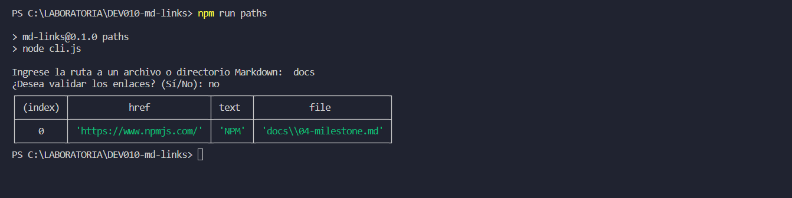
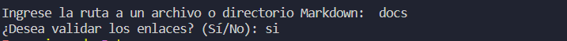
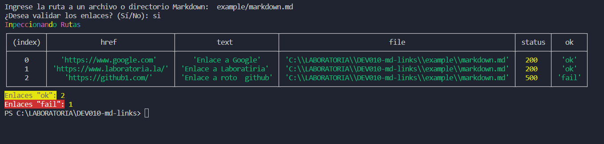
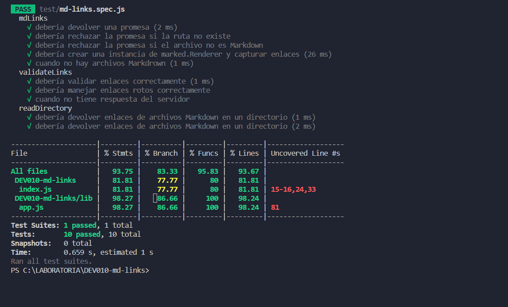

# Markdown Links

## Índice

* [1. Introduccion](#1-Introduccion)
* [2. Instalacion](#2-Instalacion)
* [3. Uso de la Api](#3-Uso-de-la-Api)
* [4. Proceso diseño y desarrollo](#4-Proceso-diseño-y-desarrollo)
* [5. Test](#5-Test)


***

## 1. Preámbulo

[Markdown](https://es.wikipedia.org/wiki/Markdown) es un lenguaje de marcado
ligero muy popular entre developers. Es usado en
muchísimas plataformas que manejan texto plano (GitHub, foros, blogs, etc.) y
es muy común encontrar varios archivos en ese formato en cualquier tipo de
repositorio (empezando por el tradicional `README.md`).

Estos archivos `Markdown` normalmente contienen _links_ (vínculos/ligas) que
muchas veces están rotos o ya no son válidos y eso perjudica mucho el valor de
la información que se quiere compartir.

Dentro de una comunidad de código abierto, nos han propuesto crear una
herramienta usando [Node.js](https://nodejs.org/), que lea y analice archivos
en formato `Markdown`, para verificar los links que contengan y reportar
algunas estadísticas.


## 2. Instalacion

Para utilizar la biblioteca `md-links`, sigue estos pasos:

1. Abre una terminal o línea de comando en el directorio de tu proyecto donde deseas utilizar la biblioteca `md-links`.

2. Ejecuta el siguiente comando npm para instalar la biblioteca:

   ```bash
   npm install paths

Una vez que hayas instalado md-links, podrás utilizarlo en tu proyecto para buscar enlaces en archivos Markdown, validar el estado de los enlaces y obtener estadísticas sobre ellos.

## 3. Uso de la Api 

## 3.1 Obtener propiedades de los links

Para efectos de la explicación ./directorio o Ruta example/mardown.md corresponderá a la ruta del archivo o directorio a analizar. Al ejecutar el siguiente comando:

npm run ./directorio  
npm run example/mardown.md

Se obtendrá un arreglo de objetos con las propiedades:

file: Ruta del archivo donde se encontró el link.  
href: URL encontrada.  
text: Texto encontrado dentro del link.  



## 3.2 Obtener propiedades y validaciones con los links

Para obtener las validaciones solo es necesario dar 'si' para ver el status de la siguiente manera:    
primero se da la direccion  de la ruta o directorio y despues preogunta si quiere las validacion y se da si.

De esta forma se obtendra un arreglo de objetos con las propiedades:  

`file: Ruta del archivo donde se encontró el link.`  
`href: URL encontrada.`  
`text: Texto encontrado dentro del link.`  
`status: Código de respuesta HTTP.`  
`ok: Si falla se obtiene un mensaje 'fail', de lo contrario 'ok'`  



Donde se muestra los links que estan Ok o Fail.

## 4. Proceso de Diseño y Desarrollo

Para la organización del proyecto se utilizó Github Proyect, con el objetivo de planificar adecuadamente los tiempos y dividir el desarrollo en metas y tareas pequeñas. Se realizó un diagrama de flujo para ordenar las funciones y el proceso de desarrollo.  

  

El desarrollo del proyecto tomo alrededor de 3 sprints y el trabajo se dividio en 5 hitos:

Hito 1: Creación de la función mdLinks que devuelve una promesa con un arreglo de tres propiedades de los links, href, text y file.

Hito 2: Incorporación del argumento validate para agregar dos propiedades sobre validaciones HTTP, status y ok.

Hito 3: Incorporacion de lectura de directorios, además de solo archivos.

Hito 4: Creación de la interfaz de línea de comando.

Hito 5: Incorporación de recursividad de la función para leer directorios.

## 5. Test

Se realizo test para validar las funciones de mdlinks donde se obtuvo el siguiente resultado:



los test que realizaron :  

 `deberia devolver una promesa.`  
 `debería rechazar la promesa si la ruta no existe.`  
 `debería rechazar la promesa si el archivo no es Markdown.`  
 `debería crear una instancia de marked.Renderer y capturar enlaces.`  
  `test para la funcion procesar el contenido y extraer enlaces`  
 `test para validar status ok y link con operadores terneareor`  
 `test para leer directorios`  